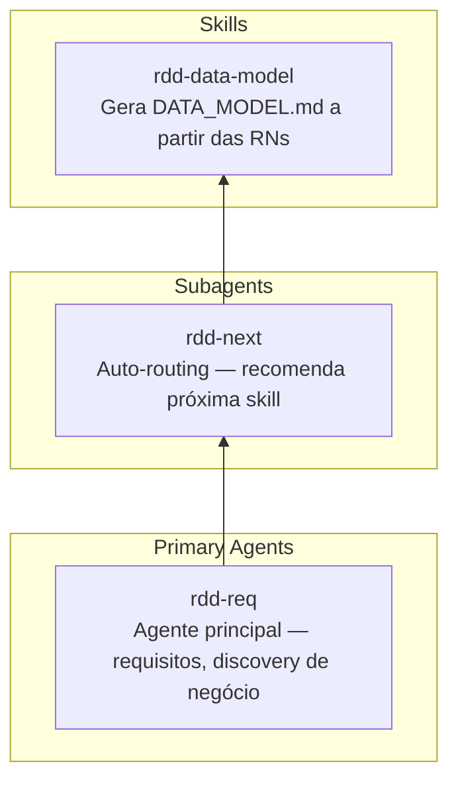
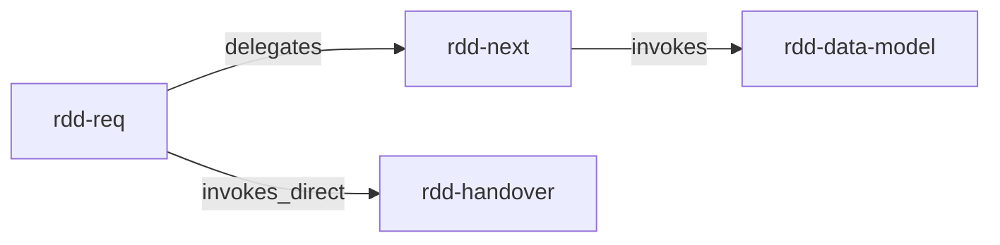

# ARCHITECTURE — TM.Opencode.RDD

## 1. Camadas

<!-- BEGIN_REGISTRY -->

```mermaid
flowchart BT
    subgraph Primary_Agents["Primary Agents"]
        rdd-req["rdd-req<br/>Agente principal — requisitos, discovery de negócio"]
    end
    subgraph Subagents["Subagents"]
        rdd-next["rdd-next<br/>Auto-routing — recomenda próxima skill"]
    end
    subgraph Skills["Skills"]
        rdd-data-model["rdd-data-model<br/>Gera DATA_MODEL.md a partir das RNs"]
    end
    rdd-req --> rdd-next
    rdd-next --> rdd-data-model
```

<!-- END_REGISTRY -->

## 2. Interações

<!-- BEGIN_REGISTRY -->

```mermaid
flowchart LR
    rdd-req -->|delegates| rdd-next
    rdd-req -->|invokes_direct| rdd-handover
    rdd-next -->|invokes| rdd-data-model
```

<!-- END_REGISTRY -->